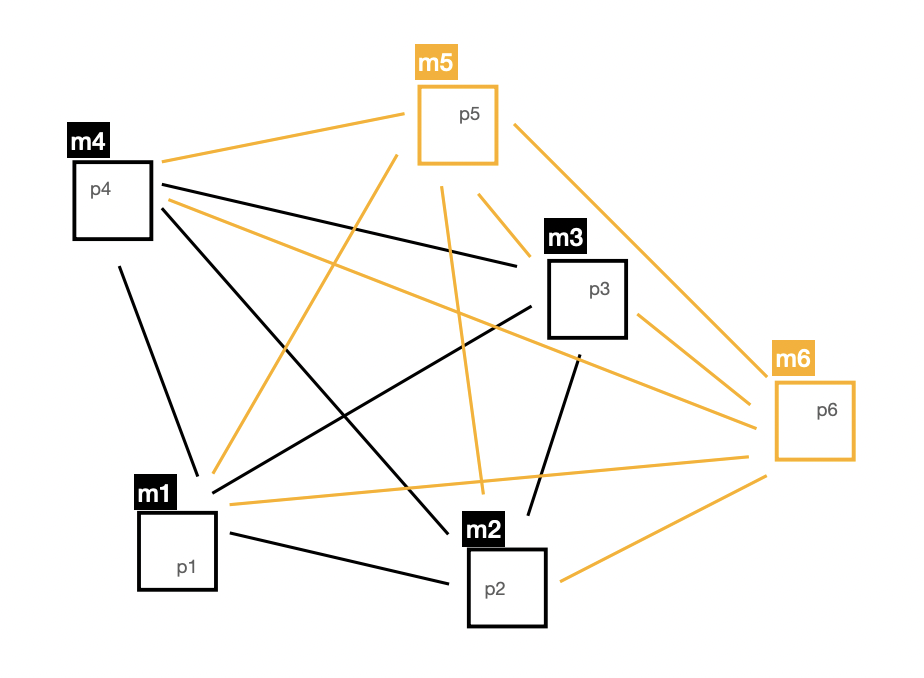

This repository contains three different distributed systems projects.
All three of them were tested in a lab with multiple machines.
Projects and their purpose shortly explained below.

Authored by Furkan Ayık

### 1. Token Ring

Allows to create a ring topology with multiple machines that passing an
integer token. Token is initially equals to 0 and it is being incremented in each 
machine before they pass it to the next machine.

#### To test:

In each machine that would be part of the network, go to directory that folder ds in. 

Run the project as shown below. Last parameter defines the root and initializing machine.
If it is `init` that machine creates the token with value zero and starts the passing process.

- Go to folder **tokenring** and compile the files with `javac *.java`
- return to root directory of ds
- Run `java ds.tokenring.TokenRing <machineName/IP> <nextMachineName/IP> init/con`

As said above last param should be `init` for only the root machine. Others can take value `con`
or any other string.

Each machine has a **shell** that allows you to give commands. Give the command 
`lock` to stop passing the token. Run `unlock` to continue.

### 2. Gossiping

Allows to create a topology which machines register eachother and generate words with a 
[Poisson Distribuion](https://en.wikipedia.org/wiki/Poisson_distribution)

When machines generate a word they pick a neighbour machine by randomly and gossip the word.
When machines receive a word that was gossiped one of the neighbours they gossip the word to
one of the randomly picked neighbour. While this process goes on, each machine keeps a list of 
received words and messages are gossiped in the network. When a machine receives a message that
was received before, machine calculates a probability to gossip it or not. It is appx %20 of chance
that repeated words are not gossiped again.

#### To test:

In each machine that would be part of the network, go to directory that folder ds in.

Run the project as shown below.

- Go to folder **gossiping** and compile the files with `javac *.java`
- return to root directory of ds
- Run `java ds.gossiping.Gossiping <machineName/IP>`

After machine is up, you need to register to other machines in order to gossip.
Each machine has a **shell** that allows you to give register commands. While process is running,
register like below;

- `register <targetMachineName/IP>`

Once you register, target machine will also save the IP of sender machine. So it works both ways.

### 3. Totally Ordered Multicast

Allows to create a topology which events are created by multiple machines independently with
[Poisson Distribuion](https://en.wikipedia.org/wiki/Poisson_distribution) and make sure events are
consumed by every producer machine with the exact order. (Imagine the machines shown as orange in the diagram
above are replica databases and they need to consume the events/messages in the exact order)

Goal: There might be differences among the machines in the network with the message receiving times.
In such cases, make sure machines still would consume the event with the same order.

Logic works with [Lamport Clock](https://en.wikipedia.org/wiki/Lamport_timestamp) 

Each machine keeps a Lamport timestamp, they update or increase their timestamps accordingly. When they send
a message, they send it to all other machines. When they receive a message, they send an acknowledgement message
to all machines. When they send either an event or an acknowledgement they attach their lamport timestamp.

Each machine keeps a priority queue and adds messages to the queue with the timestamps. Queue is ordered by timestamps
increasingly. Algorithm checks the queue every time adding a new received message and when there is at least one message
from all machines (including itself) it **consumes** the message at the top of the queue. (Except ack messages)

This way, each machine consumes the events in the exact same order.

#### To test:

In each machine that would be part of the network, go to directory that folder ds in.

Run the project as shown below.

- Go to folder **multicast** and compile the files with `javac *.java`
- return to root directory of ds
- Run `java ds.multicast.Multicast <machineName/IP> true/false [<otherMachines>]`

second parameter defines if the machine both produces/consumes events (true), or if it just consumes (false)

After the second parameter, all machines in the network (including the machine itself) should be given separated by space.
